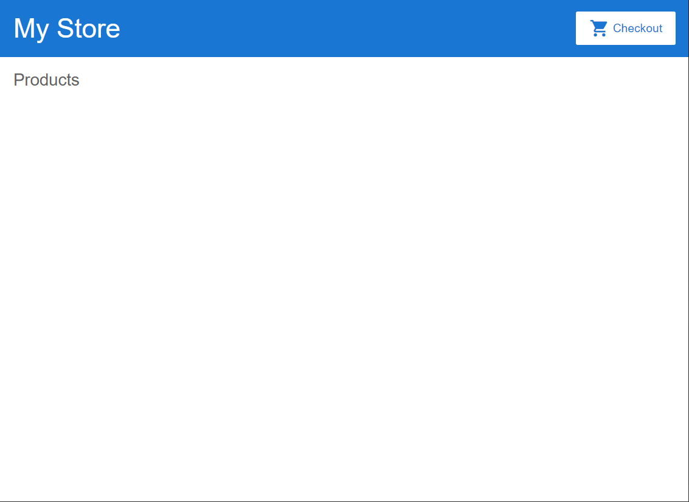
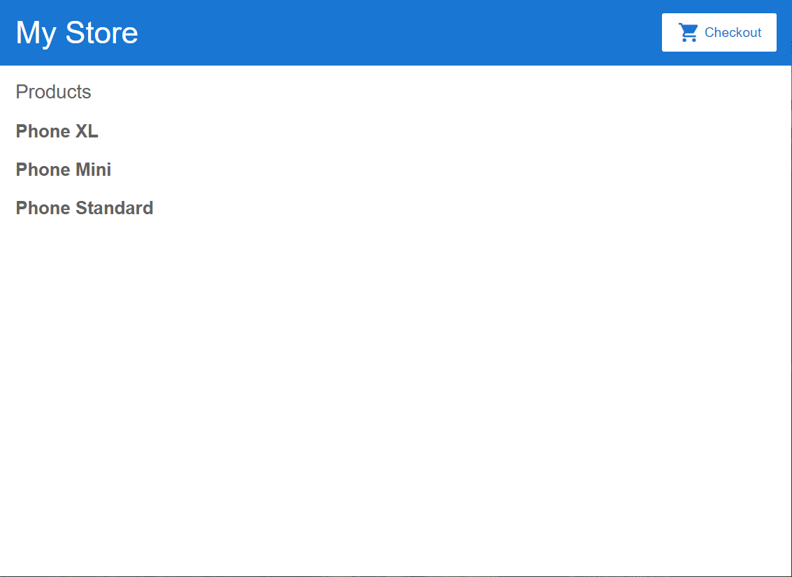
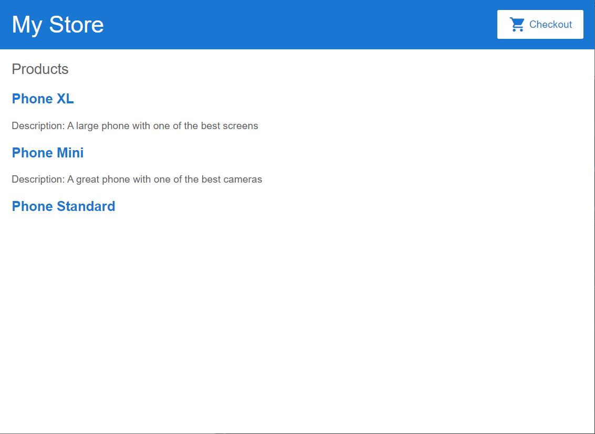
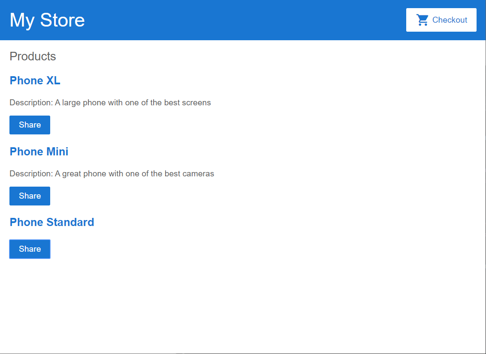
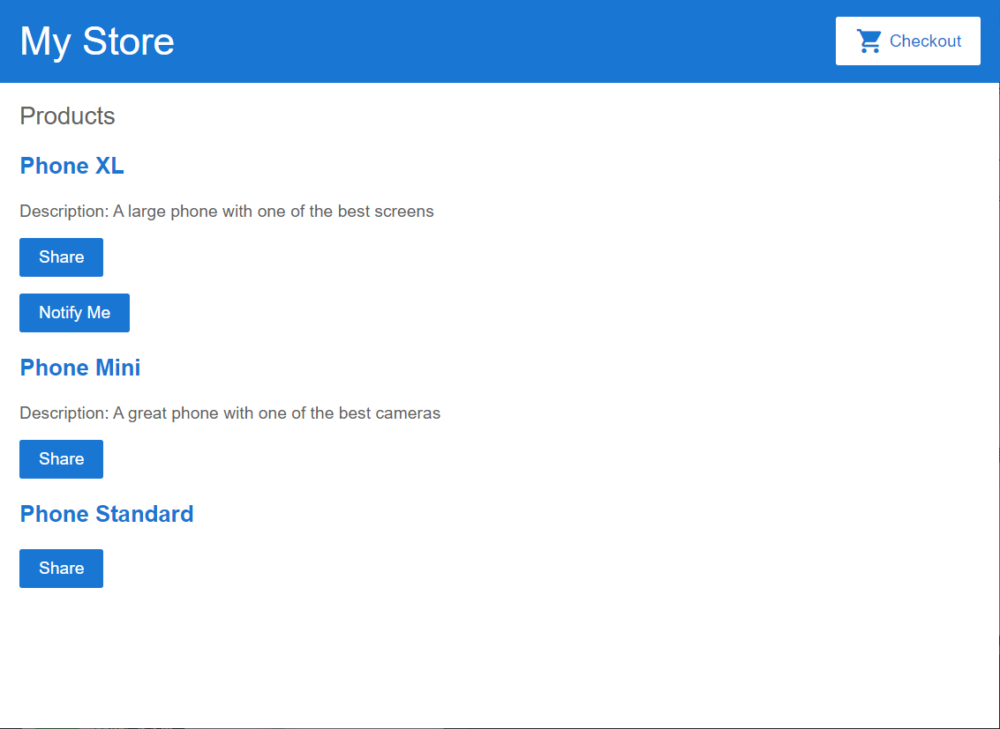
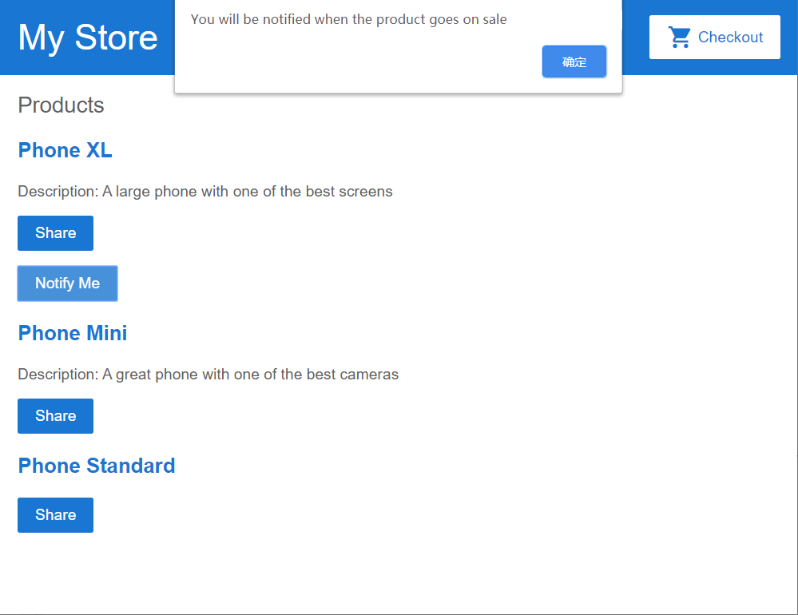
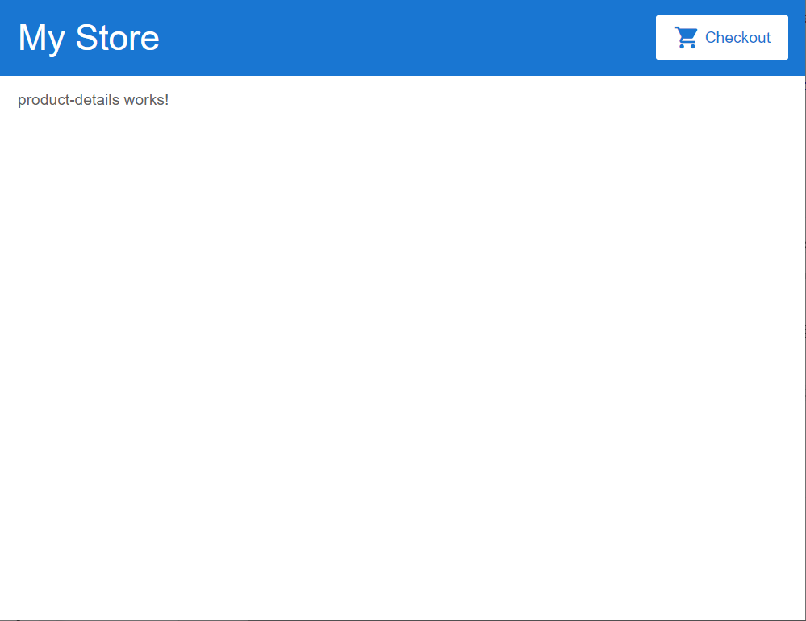
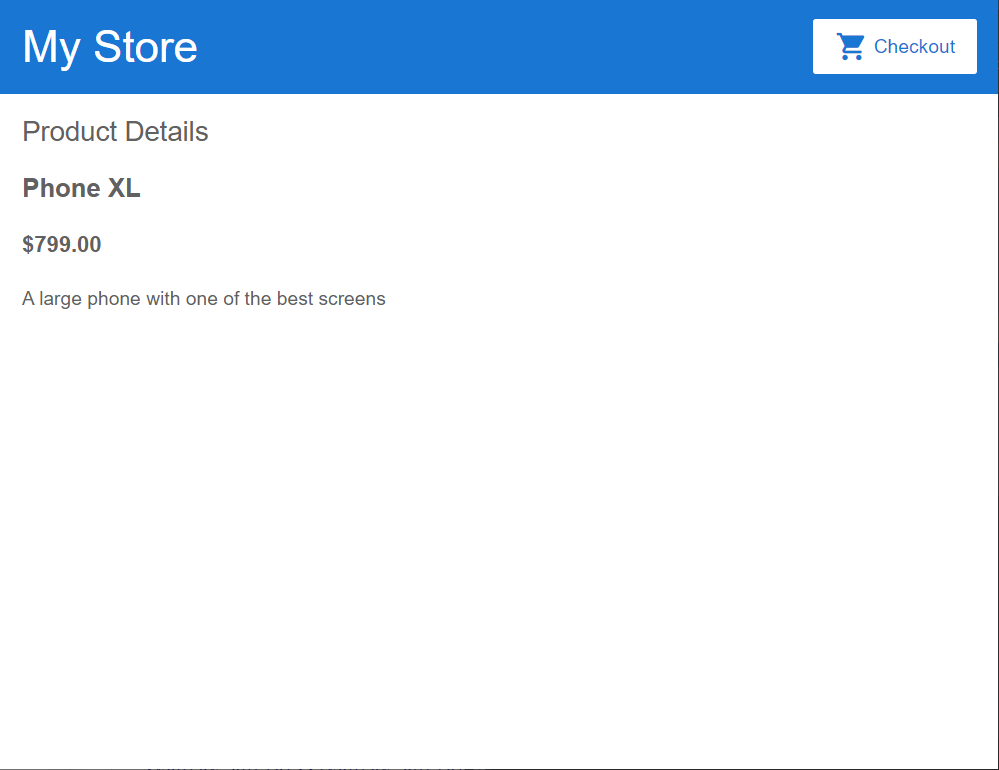

# 高级Web技术 Lab 2 : Angular 框架


# 前言

这篇 Lab 主要包括了 Angular 框架的背景、技术栈和起步指导。


## Part 1. 安装Node与npm

首先，我们需要安装 Node.js 和 npm。

前往官网下载安装 Node.js , npm 会随着 Node.js 一同安装。

#### Node.js

Node.js 是一个基于 Chrome V8 引擎的 JavaScript 运行时，可以近似理解为脱离浏览器运行 JavaScript 代码的平台。常见用途是开发后端服务器，但我们期末需要提交的 PJ 中建议使用Spring boot 开发后端，而不是Node.js。

#### npm

npm = Node Package Manager，绝大部分的现代前端项目中都使用 npm 作为包管理工具。

>原生 npm 在中国的访问速度特别慢，如果没有稳定的翻墙环境，推荐使用阿里的国内 npm 镜像：https://registry.npm.taobao.org/

要想检查你是否已经安装了 npm 客户端，请在终端/控制台窗口中运行 `npm -v` 命令。

## Part 2. 安装Angular

以下的内容来自angular.cn中文官网:《快速上手》，https://angular.cn/guide/quickstart

好的工具能让开发更加简单快捷。

本章的目标是构建并运行一个超级简单的 TypeScript Angular 应用。使用 Angular CLI 来让每个 Angular 应用从风格指南的那些建议中获益。

在本章的末尾，你会对用 CLI 进行开发有一个最基本的理解，并将其作为其它文档范例以及真实应用的基础。

#### 步骤 1. 设置开发环境

在开始工作之前，你必须设置好开发环境。

如果你的电脑里没有 Node.js®和 npm，请安装它们。

然后全局安装 Angular CLI 。

```
npm install -g @angular/cli
```

>请先在终端/控制台窗口中运行命令 node -v 和 npm -v， 来验证一下你正在运行 node 、npm 和 Angular CLI 的版本。 最新稳定的版本则没问题。


#### 步骤 2. 创建工作区和初始应用

Angular工作区就是你开发应用的上下文环境。每个工作区包含一些供一个或多个项目使用的文件。每个项目都是一组由应用、库或端到端（e2e）测试构成的文件。

要想创建工作区和初始应用项目：

1、运行下列命令来生成一个新项目以及应用的骨架代码：

```
ng new angular-learning
```

2、ng new会提示你要把哪些特性包含在初始的应用项目中。请按回车接受默认值。

Angular CLI会安装必要的Angular npm包及其它依赖。这可能要花几分钟。(卡在安装步骤的同学可以在安装cnpm后先使用`ng new angular-learning --skip-install`创建目录，然后进入angular-learning中，执行`cnpm install`安装依赖包)

还将创建下列工作区和初始项目文件：

* 一个新的工作区，根目录名叫angular-learning
* 一个初始的骨架应用项目，也叫angular-learning（但位于src子目录下）
* 一个端到端测试项目（位于e2e子目录下）
* 相关的配置文件

初始的应用项目是一个简单的“欢迎”应用，随时可以运行它。

#### 步骤 3. 启动开发服务器

Angular包含一个开发服务器，以便能轻易地在本地构建应用和启动开发服务器。

1、进入项目目录

2、使用CLI命令ng server启动开发服务器，并带上`--open`选项

```shell
cd angular-learning
ng serve --open
```

ng serve 命令会启动开发服务器，监听文件变化，并在修改这些文件时重新构建此应用。

使用 --open（或 -o）参数可以自动打开浏览器并访问 http://localhost:4200/。

会看到：


####  步骤4: 使用 npm 添加 Material UI 库

> Material UI 是 Google 推出的一套 UI 设计方案，提供了许多 UI 组件，类似于像 BootStrap 之类的 CSS 库。
>
> 使用 UI 库可以简单方便地编写界面美观的前端项目，大大优于手写 CSS。
>
> 这部分的目的是告诉同学们如何通过npm添加自定义的库，可以跳过。
>
> 参考网址：https://material.angular.io/

```shell
npm install --save @angular/cdk
npm install --save @angular/material
```

安装之后，我们可以注意到 package.json 的dependencies中多了两行：

```
......
    "@angular/cdk": "^9.0.0",
......
    "@angular/material": "^9.0.0",
......
```

新添加的库已经被记录到`package.json`中。

## Part 3. Angular 起步

在这一部分，我们会先介绍Angular的基本概念，然后构建一个简单的模拟电商网站。

请同学们先下载[项目demo](https://github.com/2020-web/Lab2.1_Code-Angular_Demo)。下载之后先尝试利用`cnpm install`和`ng serve`把网站的“壳”运行起来。



可以看到，在这个初始应用程序中，定义了一个带有带有顶栏的框架（包含商店名称和结账图标）以及一个产品列表的标题（它将用来自应用中的数据填充并动态更新产品列表）。

#### 3.1 Angular 基本概念

推荐同学们先把这两个文档看一下，建立一个大概的认识。

Angular项目代码结构： [工作区与项目文件的结构](https://angular.cn/guide/file-structure)

Angular的基本概念：[基本概念简介](https://angular.cn/guide/architecture)

#### 3.2 TypeScript

Angular 项目一般使用 TypeScript 来代替 JavaScript。直接写 JavaScript 是合法的，但是不推荐。

TypeScript 是一种编译到 JavaScript 的编程语言，弥补了一些 JavaScript 语言上的一些缺点，比 JavaScript 更加强大好用。

> TypeScript 学习：https://www.typescriptlang.org/index.html

#### 3.3 理解起始工程

下面让我们来理解一下工程的起始页面是如何工作的。

`src/app/app.module.ts` 的主要作用是导入需要用到的库（如 BrowserModule），并声明项目中包含的组件（如 AppComponent）。

`src/app/app.component.ts` 中定义了名为 `AppModule` 的根模块，它会告诉 Angular 如何组装应用。这里最初只声明一个 `AppComponent`。当你向应用中添加更多组件时，它们也必须在这里声明。

`selector: 'app-root'` 对应的是 `index.html` 中的`<app-root></app-root>`，表示当前组件的代码会被插入到 `<my-app>` 标签中。

在`src/app`路径下已经生成了两个组件`top-bar`和`product-list`。

#### 3.4 模板语法

Angular 的模板语法扩展了 HTML 和 JavaScript。

1、在 `product-list` 文件夹中，打开模板文件 `product-list.component.html`。

2、修改商品列表模板，看是否列出了商品名称。

```html
<h2>Products</h2>

<div *ngFor="let product of products">
</div>

```

列表中的每个商品都以同样的方式在页面上挨个显示出来。要遍历这些预定义的商品列表，请使用 `*ngFor` 指令，把 `*ngFor` 指令加到 `<div>` 上，有了 `*ngFor`，这个`<div>`就会被列表中的每个商品都重复渲染一次。

> `*ngFor` 是一个 "结构型指令"。结构型指令会通过添加、删除和操纵它们的宿主元素等方式塑造或重塑 DOM 的结构。任何带有星号 `*` 的指令都是结构型指令。

要显示商品的名称，请使用插值语法 `{{}}`。插值会把属性的值作为文本渲染出来。在`<div>`里面，添加一个 `<h3>` 标题来显示商品 name 属性的插值：

```html
<h2>Products</h2>

<div *ngFor="let product of products">

  <h3>
      {{ product.name }}
  </h3>

</div>
```

预览窗格会立即更新，以显示列表中每个商品的名称。



3、为了让每个商品名称都能链接到商品详情，添加一个 `<a>` 元素，并使用属性绑定语法 `[]` 把该链接的 `title` 设置成该商品的名字，如下所示：

```html
<h2>Products</h2>

<div *ngFor="let product of products">

  <h3>
    <a [title]="product.name + ' details'">
      {{ product.name }}
    </a>
  </h3>

</div>
```

在预览窗格中，将鼠标悬停在显示的商品名称上，可以看到绑定的 name 属性值。它们都是商品名加上单词 "details" 的格式。**插值 `{{}}` 允许你把属性值渲染为文本；而属性绑定语法 `[]` 则允许你在模板表达式中使用属性值。**


4、添加商品说明。在 `<p>` 标签上，使用 `*ngIf` 指令，这样 Angular 只会在当前商品有描述信息的情况下创建这个 `<p>` 元素。

```html
<h2>Products</h2>

<div *ngFor="let product of products">

  <h3>
    <a [title]="product.name + ' details'">
      {{ product.name }}
    </a>
  </h3>

  <p *ngIf="product.description">
    Description: {{ product.description }}
  </p>

</div>
```

该应用会立即在列表中显示每种商品的名称和描述。请注意，最后一个商品根本没有描述信息。由于该商品的 description 属性为空，因此 Angular 不会创建 `<p>` 元素（包括静态文本 “Description”）。



5、添加一个按钮，以便让用户可与朋友分享商品。把 button 的 `click` 事件绑定预先定义好的 `share()` 方法上（位于 `product-list.component.ts` ）。**事件绑定是通过把事件名称包裹在圆括号 `( )` 中完成的**。

```html
<h2>Products</h2>

<div *ngFor="let product of products">

  <h3>
    <a [title]="product.name + ' details'">
      {{ product.name }}
    </a>
  </h3>

  <p *ngIf="product.description">
    Description: {{ product.description }}
  </p>

  <button (click)="share()">
    Share
  </button>

</div>
```

现在，每个商品都有一个 “Share” 按钮了：



目前，该应用现在具有商品列表和共享功能。在这个过程中，你已经学会了 Angular 模板语法的五个常用特性：

- `*ngFor`
- `*ngIf`
- 插值 `{{}}`
- 属性绑定 `[]`
- 事件绑定 `()`

#### 3.5 组件

*组件*在用户界面（也就是 UI）中定义了一些责任区，让你能重用这些 UI 功能集。你已经通过商品列表组件构建了一个组件。

组件包含三部分：

- **一个组件类**，它用来处理数据和功能。上一节，我们在组件类中定义了商品数据和 `share()` 方法，它们分别用来处理数据和功能。
- **一个 HTML 模板**，它决定了 UI。在上一节中，商品列表的 HTML 模板用来显示每个商品的名称、描述和 “Share” 按钮。
- **组件专属的样式**定义了外观和感觉。商品列表中还没有定义任何样式，那属于组件 CSS 负责。

Angular 应用程序由一棵组件树组成，每个 Angular 组件都有一个明确的用途和责任。

目前，该范例有三个组件：


- `app-root`（橙色框）是应用的外壳。这是要加载的第一个组件，也是所有其它组件的父组件。你可以把它想象成一个基础页面。
- `app-top-bar`（蓝色背景）是商店名称和结帐按钮。
- `app-product-list`（紫色框）是在上一节中修改过的商品列表。

##### 组件交互

目前，商品列表会显示每个商品的名称和描述。 该商品列表组件还定义了一个 `products` 属性，它包含每个商品的导入数据（来自 `products.ts` 中的 `products` 数组。）

接下来创建一个新的提醒功能。它会接收一个商品作为输入。它会检查商品的价格，如果价格高于 700 美元，它会显示一个“Notify Me”（通知我）按钮，让用户注册一个当商品上市时发送的通知。

1、创建一个新商品提醒组件。

`ng generate component product-alerts`

该 generator 为组件的三个部分创建了启动文件：

- `product-alerts.component.ts`
- `product-alerts.component.html`
- `product-alerts.component.css`

2、打开 `product-alerts.component.ts`。

```typescript
import { Component, OnInit } from '@angular/core';

@Component({
  selector: 'app-product-alerts',
  templateUrl: './product-alerts.component.html',
  styleUrls: ['./product-alerts.component.css']
})
export class ProductAlertsComponent implements OnInit {

  constructor() { }

  ngOnInit() {
  }

}

```

`@Component` 是个装饰器函数，用于为该组件指定 Angular 所需的元数据。

CLI 自动生成了三个元数据属性：

1. `selector`— 组件的选择器（CSS 元素选择器）
2. `templateUrl`— 组件模板文件的位置。
3. `styleUrls`— 组件私有 CSS 样式表文件的位置。

[CSS 元素选择器](https://developer.mozilla.org/en-US/docs/Web/CSS/Type_selectors) `app-product-alerts` 用来在父组件的模板中匹配 HTML 元素的名称，以识别出该组件。

`ngOnInit()` 是一个[生命周期钩子](https://angular.cn/guide/lifecycle-hooks#oninit)，Angular 在创建完组件后很快就会调用 `ngOnInit()`。这里是放置初始化逻辑的好地方。

始终要 `export` 这个组件类，以便在其它地方（比如 `AppModule`）导入它。

3、设置新商品提醒组件，让它接收一个商品作为输入：

a.从 `@angular/core` 导入 `Input`(product-alerts.component.ts)。

```typescript
import { Component, OnInit } from '@angular/core';
import { Input } from '@angular/core';
```

b.在 `ProductAlertsComponent` 类的定义中，定义一个带 `@Input()` 装饰器的 `product` 属性。`@Input()` 装饰器指出其属性值是从该组件的父组件商品列表组件中传入的(product-alerts.component.ts)。

```typescript
export class ProductAlertsComponent implements OnInit {
  @Input() product;
  constructor() { }

  ngOnInit() {
  }

}
```

4、定义这个新商品提醒组件的视图。

1. 打开 `product-alerts.component.html` 模板，把作为占位符的 p 替换为如果商品价格超过 700 美元就要显示出来的“通知我”按钮。

5、现在，把这个新商品提醒组件显示为该商品列表的一部分（子组件）。

1. 打开 `product-list.component.html`。

2. 要包含这个新组件，只要像使用 HTML 元素一样使用它的选择器（ `app-product-alert` ）就可以了。

3. 通过属性绑定把当前商品作为输入传给组件。

   ```html
   <button (click)="share()">
     Share
   </button>
   
   <app-product-alerts
     [product]="product">
   </app-product-alerts>
   ```

   新商品提醒组件会从商品列表中获取商品作为输入信息。通过该输入，它会根据商品的价格显示或隐藏 “Notify Me” 按钮。由于 Phone XL 的售价超过了 700 美元，所以该商品上会出现“Notify Me”按钮。

   

   > 要了解如何将数据从父组件传递到子组件、拦截并处理来自父组件的值，以及检测并对输入属性值进行更改的更多信息，请参阅 [组件交互](https://angular.cn/guide/component-interaction)一章。

6、要想让 “Notify Me” 按钮正常工作，你需要配置两处：

- 当用户点击 “Notify Me” 时，产品提醒组件发出一个事件

- 商品列表组件对这个事件进行响应

  1.打开 `product-alerts.component.ts`。

  2.从 `@angular/core` 中导入 `Output` 和 `EventEmitter`：

  ```typescript
  import { Component } from '@angular/core';
  import { Input } from '@angular/core';
  import { Output, EventEmitter } from '@angular/core';
  ```

  3.在组件类中，添加一个用 `@Output()` 装饰器和一个事件发射器 `EventEmitter()` 实例定义一个名为 `notify` 的属性。这可以让商品提醒组件在 notify 属性发生变化时发出事件。

  ```typescript
  export class ProductAlertsComponent implements OnInit {
    @Input() product;
    @Output() notify = new EventEmitter();
    constructor() { }
  
    ngOnInit() {
    }
  
  }
  ```

  4.1. 在商品提醒模板（`product-alerts.component.html`）中，用事件绑定更新“Notify Me”按钮，以调用 `notify.emit()` 方法。

  ```html
  <p *ngIf="product.price > 700">
    <button (click)="notify.emit()">Notify Me</button>
  </p>
  ```

  4.2. 接下来，定义当用户单击该按钮时应该发生的行为。回想一下，应该由父组件（商品列表组件）采取行动，而不是商品提醒组件。在 `product-list.component.ts` 文件中，定义一个 `onNotify()` 方法，类似于 `share()` 方法：

  ```typescript
  export class ProductListComponent {
    products = products;
  
    share() {
      window.alert('The product has been shared!');
    }
  
    onNotify() {
      window.alert('You will be notified when the product goes on sale');
    }
  }
  ```

  4.3. 最后，修改商品列表组件以接收商品提醒组件的输出。

  在 `product-list.component.html` 中，把 `app-product-alerts` 组件（就是它显示的“Notify Me”按钮）的 `notify` 事件绑定到商品列表组件的 `onNotify()` 方法。

  ```html
  <button (click)="share()">
    Share
  </button>
  
  <app-product-alerts
    [product]="product" 
    (notify)="onNotify()">
  </app-product-alerts>
  ```

7、试试“Notify Me”按钮：



> 要了解关于从子组件监听事件、读取子属性或调用子方法以及如何用服务在组件之间进行双向通信的详细信息，请参阅“[组件交互](https://angular.cn/guide/component-interaction)”一章。

#### 3.6 路由

现在，这个在线商店应用会有一个基本的商品名录。该应用还没有任何可变的状态或导航。它只有一个 URL，该 URL 总是会显示“我的商店”页面，其中是商品列表及其描述。

接下来我们尝试添加Angular 路由器，来用一些独立页面显示完整的产品详情，这些页面有自己的 URL。

Angular [路由器](https://angular.cn/guide/glossary#router)能让你根据用户在应用中的位置向用户显示不同的组件和数据。当用户执行应用任务时，路由器可以从一个视图导航到另一个视图。比如：

- 在地址栏中输入一个 URL，导航到相应的页面。
- 点击页面上的链接，导航到新页面。
- 点击浏览器的后退和前进按钮，在浏览器的历史中前后导航。

##### 3.6.1 注册路由

1、首先为商品详情页生成一个新组件。把组件命名为 `product-details`。

`ng generate component product-details`

2、在 `app.module.ts` 中，添加一个商品详情路由规则，该路由的 `path` 是 `products/:productId`，`component` 是 `ProductDetailsComponent`。

```typescript
@NgModule({
  imports: [
    BrowserModule,
    ReactiveFormsModule,
    RouterModule.forRoot([
      { path: '', component: ProductListComponent },
      { path: 'products/:productId', component: ProductDetailsComponent },
    ])
  ],
```

典型的 Angular `Route` 具有两个属性：

- `path`: 用来匹配浏览器地址栏中 URL 的字符串。
- `component`: 导航到该路由时，路由器应该创建的组件。

`@NgModule` 元数据会初始化路由器，并开始监听浏览器地址的变化。

将 `RouterModule` 添加到 `imports` 数组中，同时通过调用 `RouterModule.forRoot()` 来使用路由配置：

这个方法之所以叫 `forRoot()`，是因为你要在应用的顶级配置这个路由器。 `forRoot()` 方法会提供路由所需的服务提供商和指令，还会基于浏览器的当前 URL 执行首次导航。

3、配置组件的模板，以定义用户如何导航到路由或 URL。当用户点击商品名称时，应用就会显示那个商品的详情。

1. 打开 `product-list.component.html`。

2. 修改 `*ngFor` 指令，在遍历列表的过程中把 `products` 数组中的每个索引赋值给 `productId` 变量。

3. 修改商品名称的链接，使其包含 `routerLink`。

   ```html
   <div *ngFor="let product of products; index as productId">
   
     <h3>
       <a [title]="product.name + ' details'" [routerLink]="['/products', productId]">
         {{ product.name }}
       </a>
     </h3>
   <!-- . . . -->
   </div>
   ```

   RouterLink 指令让路由器控制了一个链接元素。在这种情况下，路由或 URL 包含一个固定的区段（ `/products` ），但其最后一个区段是变量，要插入当前商品的 id 属性。例如，`id` 为 1 的商品的 URL 类似于 `http://localhost:4200/products/0`。

   通过单击商品名称来测试路由器。该应用会显示商品详情组件，该组件目前始终显示 “product-details works！”

   注意预览窗口中的 URL 变化了。它的最后一段是 `products/#`，这里的 `#` 代表你点击的那个路由的编号。

   

##### 3.6.2 使用路由信息

商品详情组件负责处理每个商品的显示。Angular 的路由器会根据浏览器的 URL 和你定义的这些路由来决定如何显示组件。本节通过 Angular 的路由器来组合使用 `products` 数据和路由信息，以显示每个商品的详情。

1、打开 `product-details.component.ts` 文件

2、改用外部文件中的商品数据。

从 `@angular/router` 包导入 `ActivatedRoute`，从 `../products` 文件导入 `products` 数组。

```typescript
import { Component, OnInit } from '@angular/core';
import { ActivatedRoute } from '@angular/router';

import { products } from '../products';
```

定义 `product` 属性，并把它加入构造函数括号中作为参数，以便把 `ActivatedRoute` 注入到构造函数中。

```typescript
export class ProductDetailsComponent implements OnInit {
  product;

  constructor(
    private route: ActivatedRoute,
  ) { }

}
```

`ActivatedRoute` 专门用于由 Angular 路由器加载的每个路由组件。它包含关于该路由，路由参数以及与该路由关联的其它数据的信息。

3、打开`product-details.component.ts`，在 `ngOnInit()` 方法中订阅了路由参数，并且根据 `productId` 获取了该产品。

```typescript
ngOnInit() {
  this.route.paramMap.subscribe(params => {
    this.product = products[+params.get('productId')];
  });
}
```

这个路由参数对应于你在路由中定义的路径变量。与该路由匹配的 URL 提供了 `productId`。 Angular 使用这个 `productId` 来显示每个单独商品的详细信息。

4、打开`product-details.component.html`，修改组件模板，在 `*ngIf` 中显示商品详情。

```html
<h2>Product Details</h2>

<div *ngIf="product">
  <h3>{{ product.name }}</h3>
  <h4>{{ product.price | currency }}</h4>
  <p>{{ product.description }}</p>

</div>
```

现在，当用户点击商品列表中的某个名字时，路由器就会导航到商品的不同网址，用商品详情组件代替商品列表组件，并显示商品详情。




## Part 4. 继续学习 Angular

继续学习 Angular 请阅读官方 Tutorial。

相关参考：

1. [动态组件加载器](https://angular.cn/guide/dynamic-component-loader)

2. [继续完善电商网站](https://angular.cn/start/data)

3. [更多demo](https://angular.cn/tutorial)

4. [基本概念](https://angular.cn/guide/architecture)

5. [模板引用变量 ( #var )](https://angular.cn/guide/template-syntax#ref-vars)

6. [Angular 4.x 动态创建组件](https://segmentfault.com/a/1190000009175508)

> Angular 官方网站: https://angular.io，中文网站：https://angular.cn。推荐先阅读文档中的 Tutorial 部分实现官方样例，再阅读 Guide 部分详细了解 Angular 的工作原理。
>
> Angular 开发相关资源：https://angular.io/resources，中文：https://angular.cn/resources。其中，IDE 推荐使用 vS Code 或者 WebStorm，Tooling 部分推荐学习 Angular CLI，UI Component 部分列举了目前主要的 UI 库，跨平台开发部分推荐了解 Ionic 和 Electron。
>
> TypeScript: https://www.typescriptlang.org/index.html
>
> npm: https://docs.npmjs.com/getting-started
>
> china npm: https://npm.taobao.org/
>
> Node.js: https://nodejs.org

## Part 5. 提交

截止时间：待定

提交方式：将实验过程记录在Lab文档中，文档里简要介绍下lab过程中遇到的问题收获以及你新添加的功能（可选），将该文档提交到超星指定的lab作业栏里。


